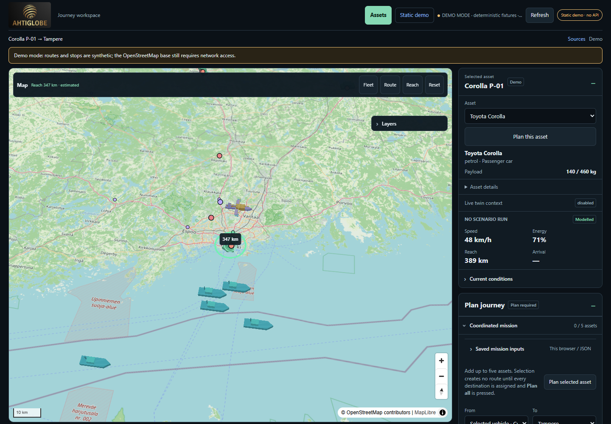
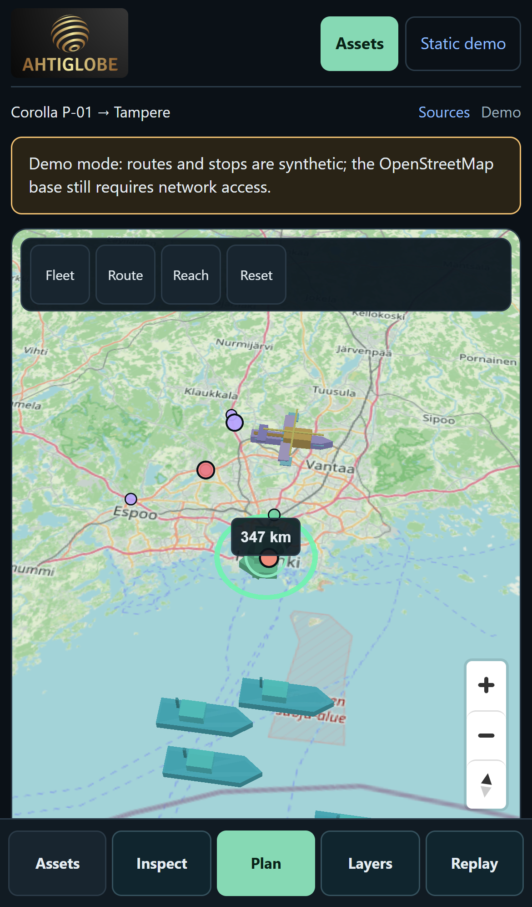

# Digital Twin Demo — Static

**[Open the demo →](https://jbita.github.io/Digital-Twin-Demo-Static/)**

A browser-based digital twin map showcase for desktop and phones. Explore representative ground, air and marine assets, compare illustrative journeys and energy use, and replay up to five selected twins on one mission clock. No installation is needed.

Phone preview

## Try it

1. **Assets:** filter/search twins; **Inspect** shows details; **Add to mission** selects a twin.
2. **Plan:** assign each destination with **Pick destinations**, or enter longitude/latitude and press **Use coordinates**. Choose a UTC start and press **Plan all assets**.
3. **Replay:** play/pause or scrub the common clock. Estimated mission end follows the longest planned journey.
4. **Layers:** adjust asset size or enable **Mission assets & paths focus** to temporarily hide distracting overlays. Disable focus to restore them.
5. **Save inputs / Export JSON:** retain setup, then explicitly replan when restoring.

On phones, use **Assets · Inspect · Plan · Layers · Replay** and close a panel to return to the map. **Fleet**, **Route**, **Reach** and **Reset** control map framing.

## What this demo includes

Bundled catalogue and demonstration data, local journey/energy models, illustrative routes and simulated playback. **No backend API calls, live telemetry, live routing or weather grids.** OpenStreetMap image tiles still require internet; downloading the offline app does not download the basemap. Results are estimates, not operational navigation. Air/marine geometry has no airspace, land, depth or fairway safety validation.

## Technology & contributions

- **JavaScript:** MapLibre/WebGL interaction, local planning/replay and browser storage; native browser execution avoids installing a client runtime. Node/esbuild builds the upstream bundle. TypeScript is a possible maintainability migration, not a current implementation or automatic speed improvement.
- **HTML/CSS:** accessible controls and responsive desktop/phone panels, without an additional UI framework's bundle and migration cost.
- **JSON:** bundled catalogue/model contracts; it is data, not executable business logic.
- **YAML:** GitHub Actions validates and publishes this prebuilt static site; it is deployment configuration.
- **Python (CI only):** verifies package checksums and static configuration; it is not needed by visitors.
- **C#, Rust and Python services:** used in the [full project](https://github.com/JbitA/Digital-Twin-Demo#languages-responsibilities-and-contribution-guide) for mission authority, telemetry and scientific ingestion/research. They do **not** run in this static demo. Keeping those services out lets an ordinary browser use the showcase without a host dependency.

Contribute application changes and focused desktop/phone regression tests to the [source project](https://github.com/JbitA/Digital-Twin-Demo); this repository publishes generated files. Preserve provider attribution and explicit data rights, never commit credentials, and validate zero API/WebSocket traffic before updating this demo. Five mission assets is the current coordinated limit, not an unlimited-fleet capacity claim.

Screenshots are actual static-build browser captures; the phone view is emulation, not a physical-device performance test. OpenStreetMap and MapLibre attribution remains in the application. See [build provenance](BUILD_PROVENANCE.json).
